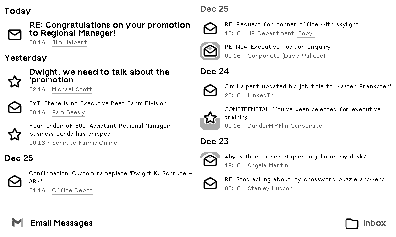

# TRMNL Email Messages Plugin

Display your recent emails directly on your TRMNL e-ink display with real-time IMAP synchronization.

## 📧 What It Does

This plugin connects to your email account via IMAP and displays your most recent messages. Perfect for keeping an eye on important emails without constantly checking your phone or computer.

## 🚀 Quick Start

1. **Choose your email provider** (Gmail, Outlook, Yahoo, iCloud, or Custom)
2. **Generate an app password** (required for security)
3. **Configure your preferences** (filters, display options, etc.)
4. **Deploy the backend** to read your emails

## 🏗️ Backend Deployment

This plugin requires a backend service to fetch emails via IMAP.
The recipe would use my personal server to get the latest email via IMAP.
If you want to fork my recipe and setup your own backend, feel free.

### Deploy with Docker

```bash
# Clone the repository
git clone https://github.com/ExcuseMi/trmnl-email-messages-plugin
cd trmnl-email-messages-plugin

# Build and run
docker-compose up -d
```

### Environment Variables

```env
ENABLE_IP_WHITELIST=true    # Restrict access to TRMNL IPs only
IP_REFRESH_HOURS=24         # How often to refresh IP whitelist
LOG_LEVEL=INFO              # Logging verbosity
HYPERCORN_WORKERS=4         # How many workers for the webserver
# Enable/disable caching
ENABLE_CACHE=true
# Cache time-to-live in seconds (default: 300 = 5 minutes)
CACHE_TTL_SECONDS=300
REDIS_HOST=redis
REDIS_PORT=6379
REDIS_DB=0
MAX_MESSAGES_LIMIT=30
IMAP_CONNECT_TIMEOUT=10
IMAP_LOGIN_TIMEOUT=15
IMAP_FETCH_TIMEOUT=30

```

## 🔧 How It Works

```
TRMNL Display → Polls Backend → Backend connects to Email via IMAP → Fetches messages → Returns to TRMNL → Displays on screen
```

1. **TRMNL polls your backend** every refresh interval
2. **Backend connects** to your email server using IMAP
3. **Fetches recent messages** based on your filters
4. **Returns data** to TRMNL in JSON format
5. **Display renders** emails using the Liquid template


## 🐛 Troubleshooting

### "Authentication failed"
- Ensure you're using an **app password**, not your regular password
- Verify 2FA is enabled (required for app passwords)
- Check that IMAP is enabled for your account

### Outlook Issues
- New Outlook accounts may have limited IMAP support
- Approve connection in [account activity](https://account.live.com/activity)
- Wait 20-30 minutes after creating app password


## 📄 License

MIT License - See LICENSE file for details


<!-- PLUGIN_STATS_START -->
## 🚀 TRMNL Plugin

*Last updated: 2025-12-27 06:25:45 UTC*


##  [Email Messages](https://usetrmnl.com/recipes/198482)



### Description
Display your recent emails on your TRMNL display.<br /><br />
This plugin connects to your email account via IMAP and shows your latest messages with customizable filters and display options.<br /><br />
<strong>IMAP support:</strong> Works with Gmail, Outlook, Yahoo, iCloud, and custom IMAP servers<br />
<strong>Real-time updates:</strong> Shows the latest emails from your inbox<br />
<strong>Advanced filtering:</strong> Filter by sender, category, or importance<br />
<strong>Custom display:</strong> Control how emails appear on your screen


### 📊 Statistics

| Metric | Value |
|--------|-------|
| Installs | 1 |
| Forks | 5 |

---

<!-- PLUGIN_STATS_END -->
